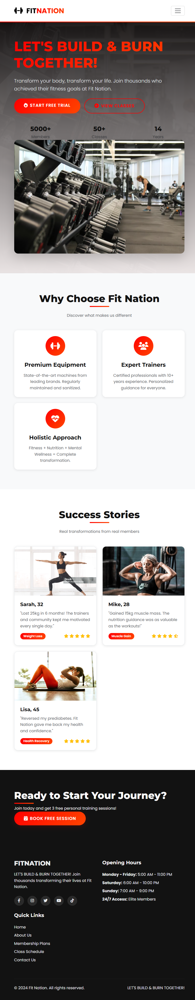
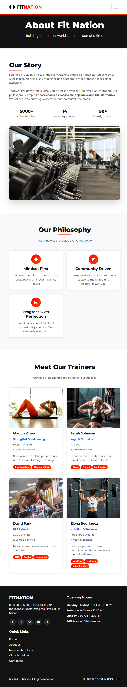
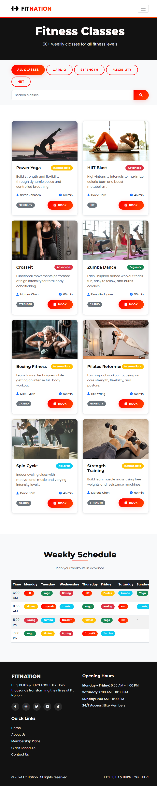
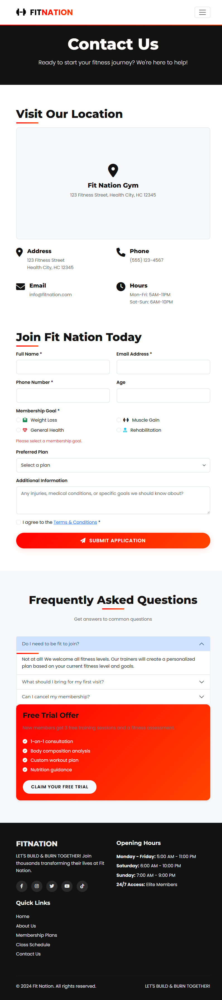

# Fit Nation - Fitness Website

## Project Information

- **Name:** [Muskan]
- **Roll Number:** [Your Roll Number]
- **Track Chosen:** HTML/CSS/JS (Track B)
- **Project Name:** Fit Nation Gym & Fitness Center
- **Deadline:** 8th Jan, 2025

## Project Overview

A responsive, modern fitness website for "Fit Nation" built with HTML5, CSS3, JavaScript, and Bootstrap 5 following the exact color scheme from the Fit Nation logo.

## Logo Color Theme Implementation

- **"FIT"**: `#000000` (Pure Black)
- **"NATION"**: `#FF0000` → `#FF4500` gradient (Red to Red-Orange)
- **Background**: Clean white (`#FFFFFF`)
- **Consistent gradient application throughout website**

## Screenshots

1. **Homepage** (`index.html`):
   

2. **About Us** (`about.html`):
   

3. **Services/Pricing** (`services.html`):
   

4. **Classes** (`classes.html`):

   - **Dynamic class listings** from JavaScript array
   - **Search/Filter functionality** (All, Cardio, Strength, Flexibility, HIIT)
     

5. **Contact** (`contact.html`):
   - Location information
   - **Join Now form with validation**
     
